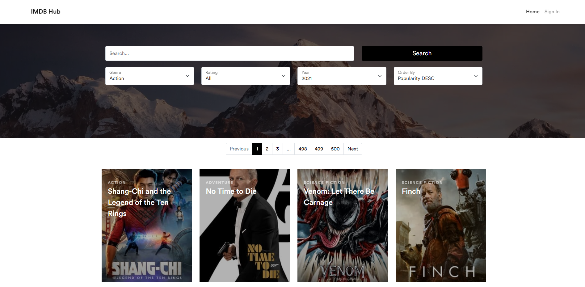
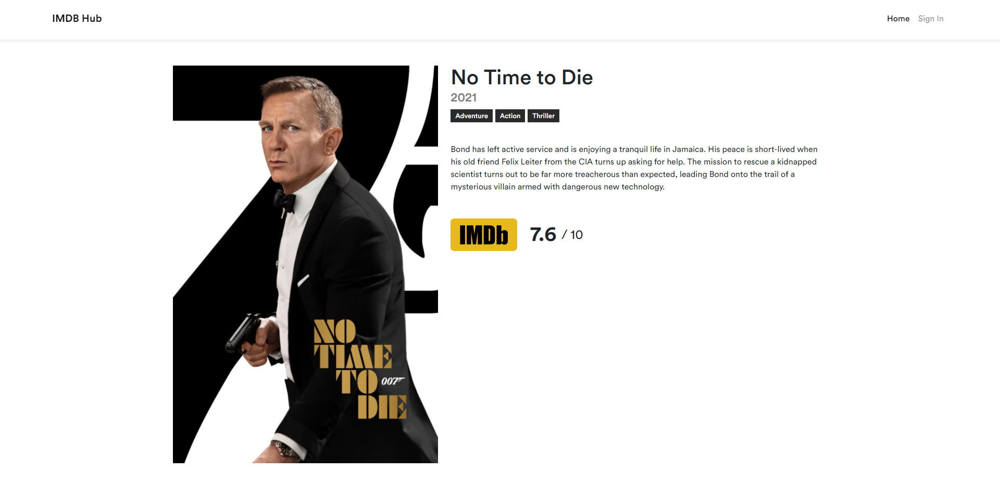
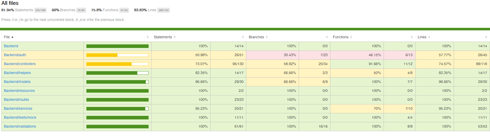

# Movie-Library

## UI Samples

## To Run front end and back end in dev environment

First you have to create a mysql database and have to add necessary credentials to the /config/config.json

`"username": "user",
"password": "secret",
"database": "movie_library",
"host": "mysql_server",
"port": "3306",
"dialect": "mysql",`

To run backend - From the Backend directory, you can run:

### `npm install`
### `npm run dbmigrate`
### `npm start`

Open [http://localhost:8042](http://localhost:8042) to view it in the browser.

To run frontend - From the Frontend directory, you can run:

### `npm install`
### `npm start`

Open [http://localhost:3000](http://localhost:3000) to view it in the browser.

## API Documentation

Swagger URL - [http://localhost:8042/api-docs](http://localhost:8042/api-docs)

## Build using docker compose

### To build and run
docker-compose up -d

### To rebuild and run

docker-compose build or docker-compose up --build

## To Run Test Cases in Development

First you have to create a mysql test database and change the necessary credentials in config/config.json.

    "username": "root",

    "password": null,

    "database": "movie_library_test",

    "host": "mysql_server",

    "dialect": "mysql",

    "migrationStorage": "sequelize",

    "migrationStorageTableName": "sequelize_meta",

    "seederStorage": "sequelize",

    "seederStorageTableName": "sequelize_seeders"

#### Run Migrations - `npm run dbmigrate:test`

#### Run Test Cases - `npm run test:coverage`

After running above commands you can generate the coverage report of the backend integration.

### Coverage report sample ([http://localhost:8042/coverage](http://localhost:8042/coverage))

**Important - After you signed up to the system and if you didn't receive a verification email just logged in to development database and make is_verified =  true**

